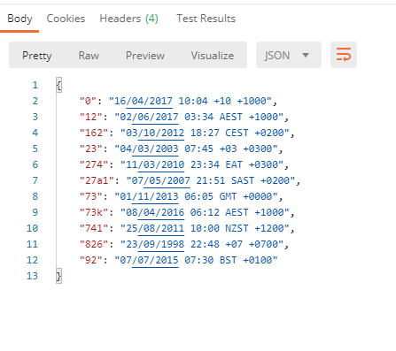
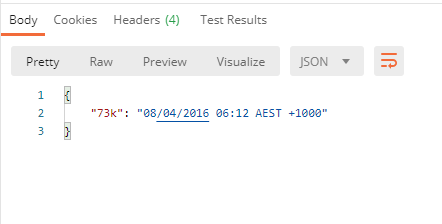
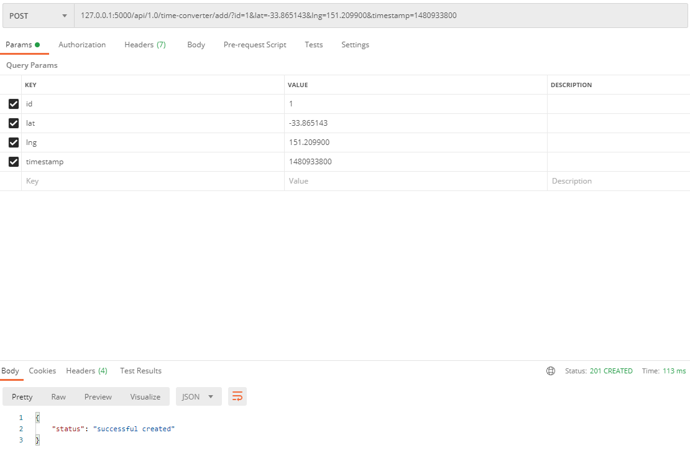
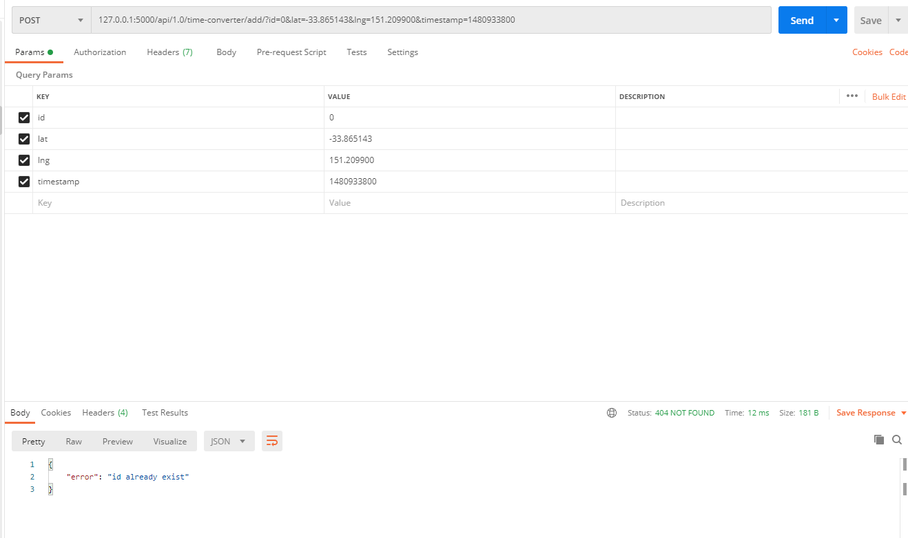
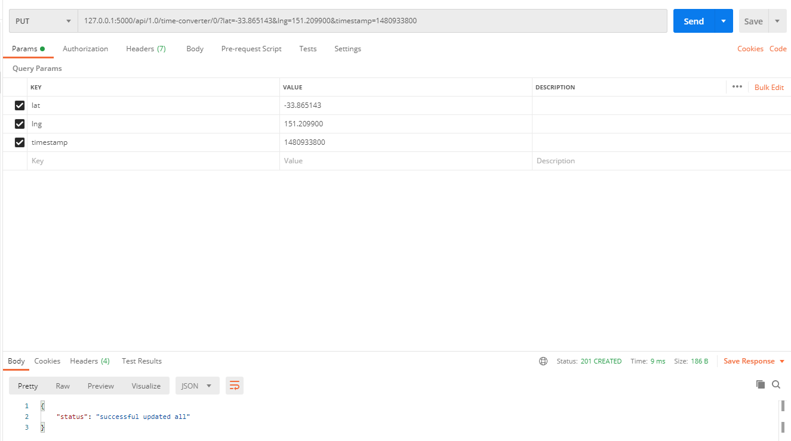
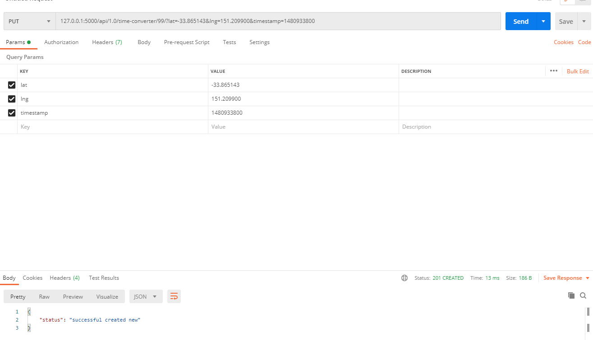
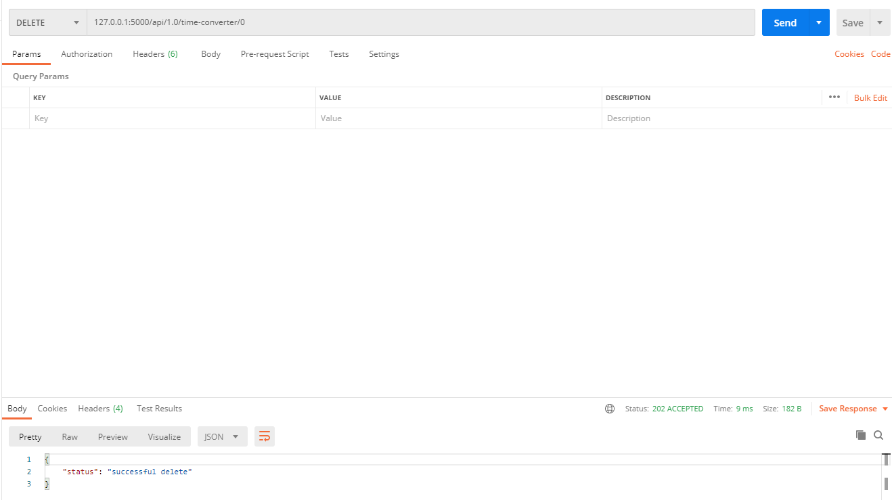
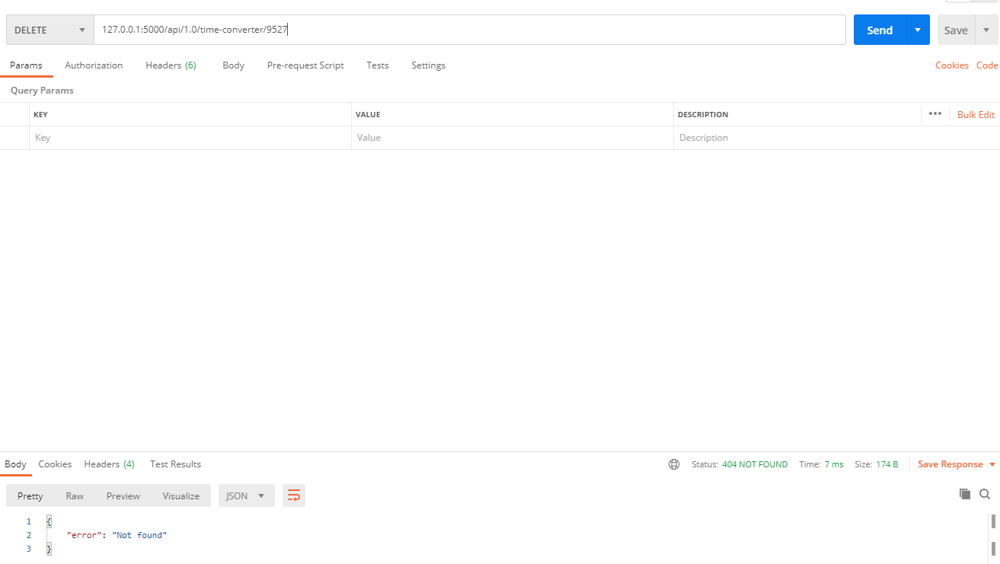

## File Structure
mini-project  
├── Controllers_1_0  
│&nbsp;&nbsp;&nbsp;&nbsp;&nbsp;├── __init__.py  
│&nbsp;&nbsp;&nbsp;&nbsp;&nbsp;└── time_converter_controller.py  
├── Input_csv_files  
│&nbsp;&nbsp;&nbsp;&nbsp;&nbsp;├── timezone.csv  
│&nbsp;&nbsp;&nbsp;&nbsp;&nbsp;└── timezone_modified.csv 
├── Tests  
│&nbsp;&nbsp;&nbsp;&nbsp;&nbsp;├── __init__.py  
│&nbsp;&nbsp;&nbsp;&nbsp;&nbsp;└── time_converter_controller.py  
├── utils  
│&nbsp;&nbsp;&nbsp;&nbsp;&nbsp;├── csv_file_parser.py  
│&nbsp;&nbsp;&nbsp;&nbsp;&nbsp;├── distance_measurement.py  
│&nbsp;&nbsp;&nbsp;&nbsp;&nbsp;└── timezone_converter_utils.py  
├── Websocket_1_0  
│&nbsp;&nbsp;&nbsp;&nbsp;&nbsp;├── distance_measurement_websocket.py  
│&nbsp;&nbsp;&nbsp;&nbsp;&nbsp;└── live_measurement_websocket.py  
├── app.py  
├── config.py  
├── Dockerfile  
└── startup.py  

## How to run program?
### From Docker Image
### Get Image from "docker pull skynapier/mini-project:1.0"

### command
docker run --name mini-project -d -p 5000:5000 mini-project ./app.py

docker run --name mini-project -d -p 5000:5000 skynapier/mini-project:1.0 ./app.py

docker build -t mini_project .

docker save --output C:\Users\skynapier\Desktop\mini-project\mini-project.tar mini-project

## Restful API
### GET all
127.0.0.1:5000/api/1.0/time-converter/all

### GET by id
127.0.0.1:5000/api/1.0/time-converter/73k

### POST 
#### Post ADD id not exist
127.0.0.1:5000/api/1.0/time-converter/add/?id=1&lat=-33.865143&lng=151.209900&timestamp=1480933800

#### Post ADD id exist
127.0.0.1:5000/api/1.0/time-converter/add/?id=1&lat=-33.865143&lng=151.209900&timestamp=1480933800

### PUT 
#### PUT update with id  exist
127.0.0.1:5000/api/1.0/time-converter/0/?lat=-33.865143&lng=151.209900&timestamp=1480933800

#### PUT update with id not exist
127.0.0.1:5000/api/1.0/time-converter/99/?lat=-33.865143&lng=151.209900&timestamp=1480933800

### Delete 

#### Delete successful
127.0.0.1:5000/api/1.0/time-converter/0

#### Delete fail
127.0.0.1:5000/api/1.0/time-converter/9527

